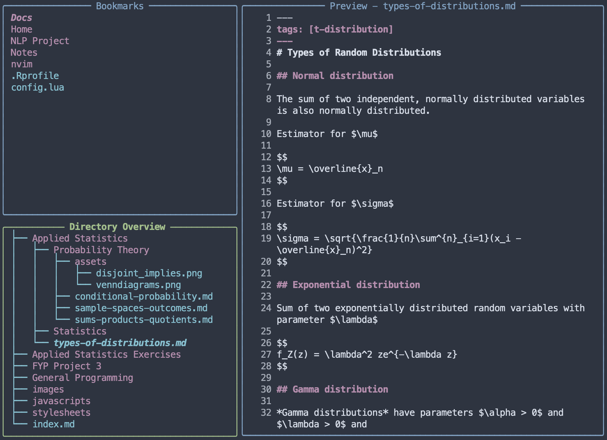
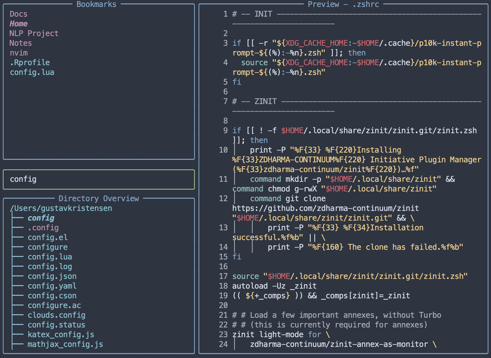

# Python-bookmarks

A CLI-tool with a TUI based on Rich to handle bookmarking directories in shell environments.

## Demo

## Screenshots:

### File tree

### Searching functionality

## Dependencies

All the python library dependencies will be installed automatically.
 is an optional dependency. It is used
for searching if it is available in PATH, otherwise python library `thefuzz` is
used. `fzf` is faster and more effective, so it is recommended to install it.

### Disclaimer

I made this project as a demo for practice, it is not intended for practical use.
